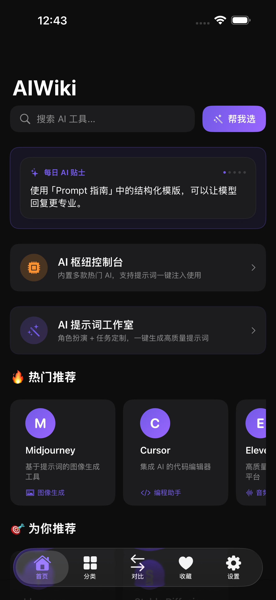
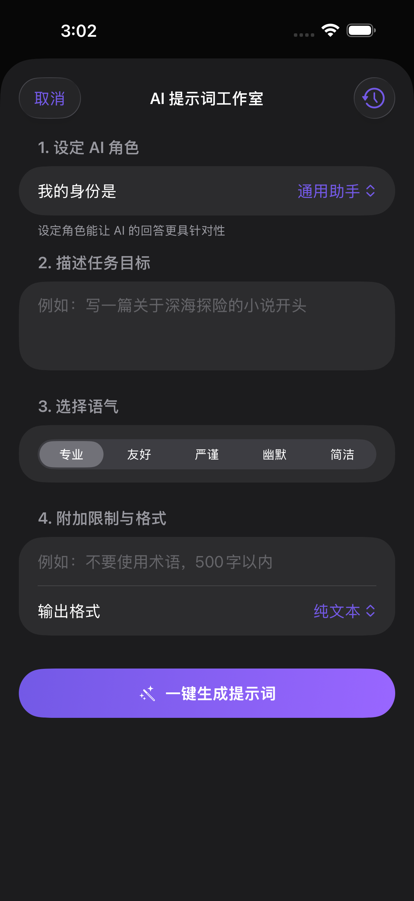
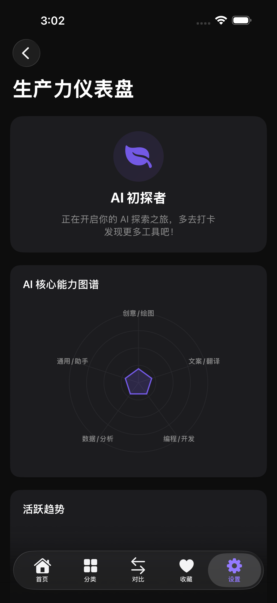
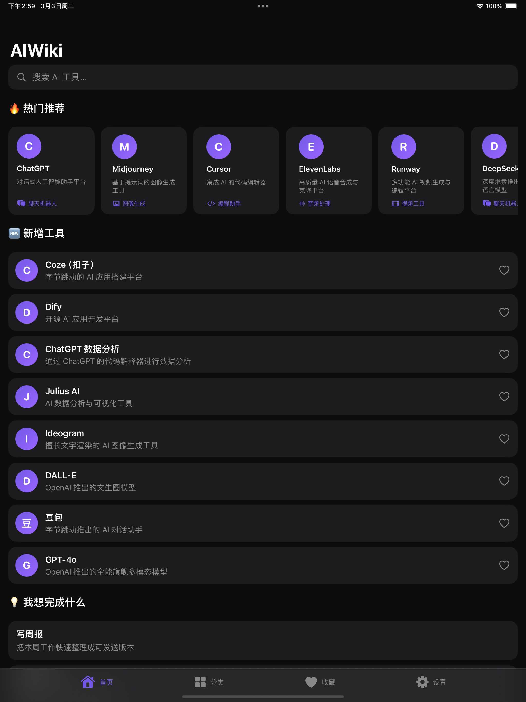

# AIWiki - AI 知识百科 & 工具导航

[English](#english) | [简体中文](#简体中文)

---

<a name="english"></a>
# AIWiki (iOS)

AIWiki is a minimalist, privacy-focused iOS application designed to provide a comprehensive knowledge base of AI tools and technologies. It works entirely offline, ensuring your data stays on your device.

## 📱 Screenshots

<div align="center">
  
  
  
</div>

*iPad View:*
<div align="center">
  
</div>

## ✨ Key Features

- **🚀 100% Offline**: All AI tool data is pre-packaged. No network requests, no latency.
- **🛡️ Privacy First**: No tracking, no analytics, no accounts. Your favorites are stored locally.
- **🔍 Intelligent Search**: Fast, fuzzy search through tool names, categories, and descriptions.
- **📚 Categorized Browsing**: Explore AI tools by category: Chatbots, Image Generation, Coding Assistants, and more.
- **⭐ Local Favorites**: Save tools you use frequently for quick access.
- **🌓 Dark Mode**: Full support for system-wide light/dark themes.

## 🛠️ Technical Stack

- **UI Framework**: SwiftUI
- **Architecture**: MVVM (Model-View-ViewModel)
- **Programming Language**: Swift 5.0+
- **Database**: SQLite with FTS5 for high-performance full-text search.
- **Project Structure**: Clean architecture with separate layers for Features, Core, and Data.

## 🏗️ Build Instructions

This project uses **XcodeGen** to manage the project file.

1. Ensure you have [XcodeGen](https://github.com/yonaskolb/XcodeGen) installed.
2. Run the following command in the root directory to generate the `.xcodeproj`:
   ```bash
   xcodegen generate
   ```
3. Open `AIWiki.xcodeproj` in Xcode and build for your target device or simulator.

## Copy quality check

Run the English localization style check before committing seed copy changes:

```bash
python3 scripts/check_en_localizable_style.py
```

Or use the shared check entrypoints:

```bash
make lint-copy
bash scripts/check_all.sh
```

## Git hooks

Install the local git hook template to run the same localization style check before commit:

```bash
bash scripts/install_git_hooks.sh
```

## App Store screenshots

Localized screenshot assets are organized by locale:

- Raw device captures: `screenshots/raw/zh-Hans` and `screenshots/raw/en-US`
- Final App Store images: `screenshots/AppStore/zh-Hans` and `screenshots/AppStore/en-US`

To generate localized App Store composites from raw captures:

```bash
swift screenshots/make_screenshots.swift zh-Hans
swift screenshots/make_screenshots.swift en-US
```

To capture raw screenshots from UI tests and generate the localized App Store set in one step:

```bash
bash scripts/generate_screenshots.sh zh-Hans
bash scripts/generate_screenshots.sh en-US
```

You can also pass a custom simulator destination:

```bash
bash scripts/generate_screenshots.sh en-US "platform=iOS Simulator,name=iPad Pro 13-inch (M4)"
```

## App Store release automation

This repo includes a local App Store release flow based on `fastlane`.

Main entrypoint:

```bash
bash scripts/release_to_app_store.sh --version 1.0.0 --build-number 12
```

Release metadata lives in `fastlane/metadata`, and localized screenshots are uploaded from `screenshots/AppStore`.
If your Xcode Cloud environment supports text-only secrets, the App Store Connect `.p8` can also be provided through `APP_STORE_CONNECT_KEY_CONTENT`.

Full setup instructions:

- `docs/app-store-release.md`

Xcode Cloud can also drive the whole archive -> export -> upload -> submit flow using `ci_scripts/ci_post_xcodebuild.sh`.

---

<a name="简体中文"></a>
# AIWiki (iOS) - 简体中文

AIWiki 是一款极简且注重隐私的 iOS 应用，旨在提供全面的 AI 工具与技术知识库。它完全离线运行，确保您的数据保留在设备上。

## ✨ 核心特性

- **🚀 100% 离线**: 所有 AI 工具数据均为预打包。无网络请求，零延迟。
- **🛡️ 隐私至上**: 无追踪、无统计、无账号。您的收藏仅存储在本地。
- **🔍 智能搜索**: 支持对工具名称、分类和描述进行快速模糊搜索。
- **📚 分类浏览**: 按分类探索 AI 工具：聊天机器人、图像生成、编程助手等。
- **⭐ 本地收藏**: 收藏常用工具，方便快速访问。
- **🌓 深色模式**: 完美支持系统浅色/深色主题。

## 🛠️ 技术栈

- **UI 框架**: SwiftUI
- **架构**: MVVM (Model-View-ViewModel)
- **编程语言**: Swift 5.0+
- **数据库**: 使用 SQLite (FTS5) 实现高性能全文检索。
- **项目结构**: 清晰的架构，包含 Features、Core 和 Data 分层。

## 🏗️ 构建说明

本项目使用 **XcodeGen** 管理项目文件。

1. 确保已安装 [XcodeGen](https://github.com/yonaskolb/XcodeGen)。
2. 在根目录运行以下命令生成 `.xcodeproj`：
   ```bash
   xcodegen generate
   ```
3. 在 Xcode 中打开 `AIWiki.xcodeproj` 并构建。

## 📄 License

Project is licensed under the [MIT License](LICENSE).
